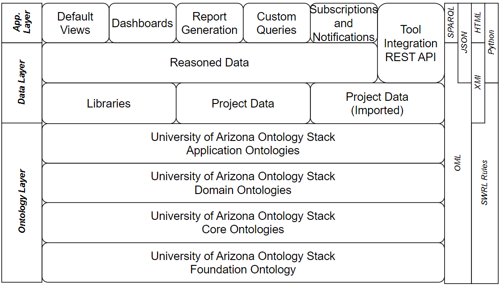

# University of Arizona Ontology Stack (UAOS) 

  

UAOS: A collection of <b>OML ontologies</b> developed by the <b>University of Arizona</b> to support <b>Digital Engineering</b>. 

 

---

## 🔹 Overview  

The **UA Ontology Stack** provides a structured, semantic foundation for digital engineering by incorporating **formal ontologies** for information modeling of engineering processes. It is built upon **Basic Formal Ontology (BFO)** and consists of **core ontologies**, **domain-specific ontologies**, and **application ontologies** that facilitate interoperability and knowledge integration.  

---

## 🔹 UA Foundation Ontology  

The **UA Foundation Ontology** is rooted in **Basic Formal Ontology (BFO)** and serves as the backbone for the entire ontology stack.  

---

## 🔹 UA Core Ontologies  

The **UA Ontology Stack** leverages five **Core Ontologies** to model fundamental concepts:  

- 📄 **Information**  
- 👤 **Agent**  
- ⏳ **Event**  
- 📏 **Measurement**  
- 🔗 **Provenance**  

---

## 🔹 UA Domain Ontologies  

The **UA Ontology Stack** extends into **14 Domain Ontologies**, each supporting a specific area of digital engineering:  

- 📦 **Acquisition**
- 🔗 **Bayesian Networks**
- 📊 **Data Management**  
- 🏗️ **Manufacturing**  
- 🚀 **Mission**  
- 🎭 **Modeling and Simulation**
- 🌍 **Orbits and Trajectories**  
- 📅 **Project Management**  
- 📜 **Requirements**  
- 💻 **Software**  
- 🏛️ **System Architecture**  
- 🛠️ **Test**
- 📖 **Use Cases** 

---

## 🔹 Application Ontologies  

Application frameworks built on top of the **UA Ontology Stack** help in real-world, application-specific implementations. Included in this repository is:  

- ⚙️ DoD TEMP Framework  

The **DoD TEMP Framework** is an **OML-based** representation of the **Test and Evaluation Master Plan (TEMP)** as outlined in **DoDI 5000.89**.  

---

## 🔹 Example Projects

This repository contains multiple example projects. Each project contains OML descriptions that conform to a subset of the UAOS ontologies. 

- **📌 DoD Example** – An anonymized test program  
- **🚀 DoD Example Rover** – A notional **Rover test program**  

---

## 🔹 References

---

## 🔹 Get Involved  

Have feedback or suggestions? Contributions are welcome! Feel free to submit issues or pull requests to help improve the **UA Ontology Stack**.  
Email me at joegregory@arizona.edu
